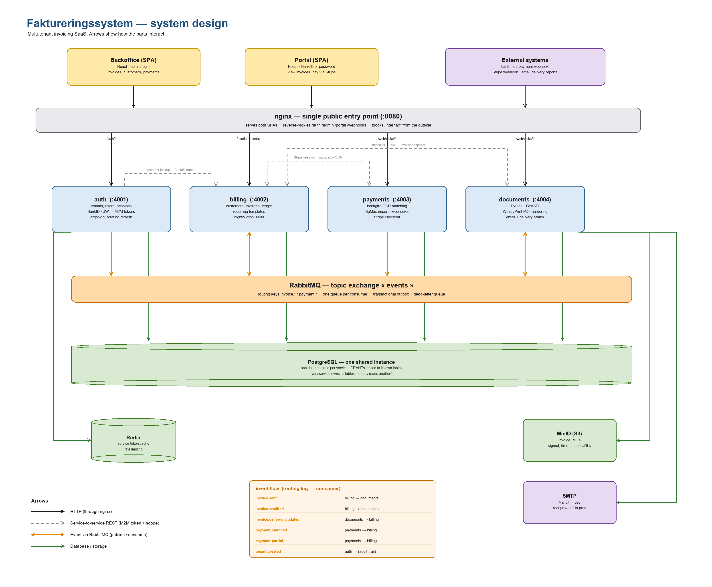

# Faktureringssystem

A multi-tenant invoicing platform for Swedish businesses — automatic payment matching, BankID login, Stripe checkout, and a separate portal for customers.

A TypeScript/Bun monorepo: four independent backend services (auth, billing, payments, and a Python service for PDF/email) talking over RabbitMQ, behind a single nginx gateway, sharing one Postgres database, with two separate React front-ends — one for the business, one for their customers.

## What it does

A company signs up and gets its own fully isolated account.

**For the business:**
- Create and send invoices, with VAT and totals calculated automatically
- Payments match themselves — incoming bank payments (file import or webhook) are matched to the right invoice by reading the OCR reference printed on it, no manual reconciliation for the common case
- Overdue invoices chase themselves — a nightly job marks them overdue and generates a reminder invoice with a late fee, without ever editing or deleting the original
- Recurring invoices (subscriptions, rent, retainers) are configured once and generate themselves from then on
- Manage customers, and resolve the rare payment that couldn't be matched automatically

**For their customers:**
- Log in with BankID or a password, in a portal that's entirely separate from the business side
- View invoices and download PDFs
- Pay directly through Stripe
- See an account overview of what's outstanding
- One BankID identity can be linked to several companies at once — a private customer of three different suppliers signs in once and switches between them, instead of juggling three separate accounts

One company can never see another's data — not "the query happens to filter correctly," but enforced at the data-access layer itself.

## Architecture



Four backend services, one shared Postgres database, RabbitMQ as the event bus between them. Three services are TypeScript on Bun/Fastify; the fourth — PDF rendering and email delivery — is Python/FastAPI, picked specifically for WeasyPrint's real CSS-based PDF layout.

- **auth** — registration, sessions, BankID, service-to-service tokens
- **billing** — customers, invoices, the payments ledger, recurring invoice templates, the nightly job
- **payments** — bank payment matching (file import + webhook), Stripe checkout sessions
- **documents** (Python) — PDF rendering, email delivery, bounce/delivery-status webhooks

Two React/Vite front-ends (backoffice, portal) talk to the services only through nginx. Internal service-to-service routes (`/internal/*`) are blocked at the nginx layer as a second line of defense, on top of their own service-token auth.

Billing publishes `invoice.sent` when an invoice goes out; documents consumes it, renders the PDF, sends the email, and publishes `invoice.delivery_updated` back. Payments publishes `payment.matched` when an incoming payment is tied to an invoice, which billing consumes to book it.

Events are written to the database in the same transaction as the data they describe (transactional outbox), so a crash can never lose one. Every event consumer, webhook, and invoice-creating API call is idempotent — a retried webhook, a redelivered event, or a duplicate `POST` never double-books a payment or sends a second invoice.

## Testing

- 103 end-to-end tests across 11 files, run against the real docker-compose stack in CI — not mocks. Tenant isolation, the full invoice lifecycle, payment matching, BankID, Stripe, all exercised over real HTTP against real Postgres and RabbitMQ.
- Around 250 unit tests for the pure logic underneath it (VAT rounding, OCR generation, payment-matching rules, recurring-invoice date math).
- Every migration is tested `up → down → up` in CI, on every PR — not just written and trusted.
- CI pipeline: lint + typecheck → unit tests (TS and Python) → migration reversibility → full Docker build and an end-to-end smoke test.

## Stack

| | |
|---|---|
| Backend | TypeScript · Bun · Fastify · PostgreSQL · RabbitMQ · Redis |
| PDF & email | Python · FastAPI · WeasyPrint |
| Frontend | React · TanStack Query · Tailwind · Vite |
| Auth | Argon2id · JWT · BankID |
| Payments | Stripe · Bankgiro/OCR matching |
| Infra | Docker Compose · nginx · GitHub Actions |

## Running it locally

```bash
cp .env.example .env
docker compose up -d
docker compose exec migrate bun run migrate
```

This brings up all four services behind nginx on `localhost:8080`, plus Postgres, Redis, RabbitMQ, MinIO (S3-compatible storage) and Mailpit (catches outgoing email locally instead of sending it).

```bash
bun install
bun run lint            # Biome
bun run typecheck       # tsc --noEmit, per workspace
bun test                # all TypeScript tests
```

The Python service manages its own environment with `uv`:

```bash
cd services/documents
uv sync
uv run pytest
```

## Project layout

```
services/    auth, billing, payments (TypeScript/Fastify), documents (Python/FastAPI)
packages/    shared (db, RabbitMQ, auth, logging), contracts (schemas shared across languages)
apps/        backoffice (admin), portal (customer-facing)
migrations/  one file per phase, each with a tested down migration
infra/       nginx config, RabbitMQ setup
```
